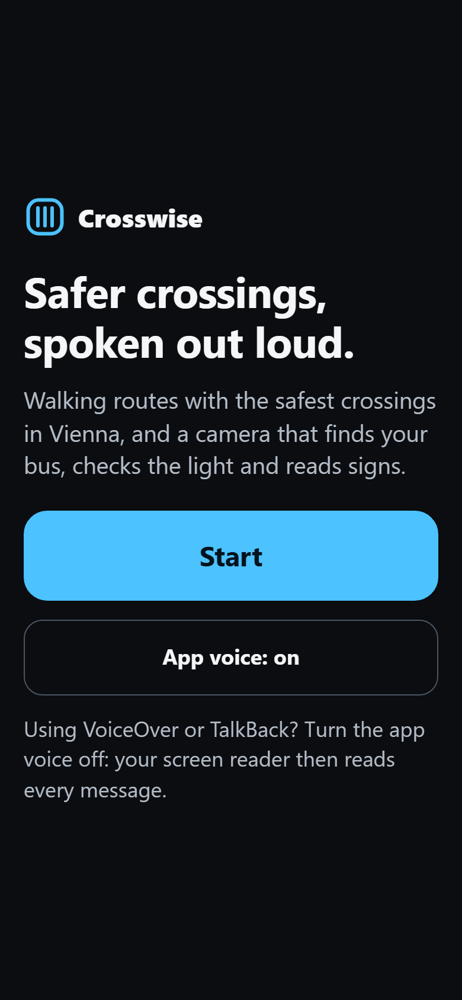
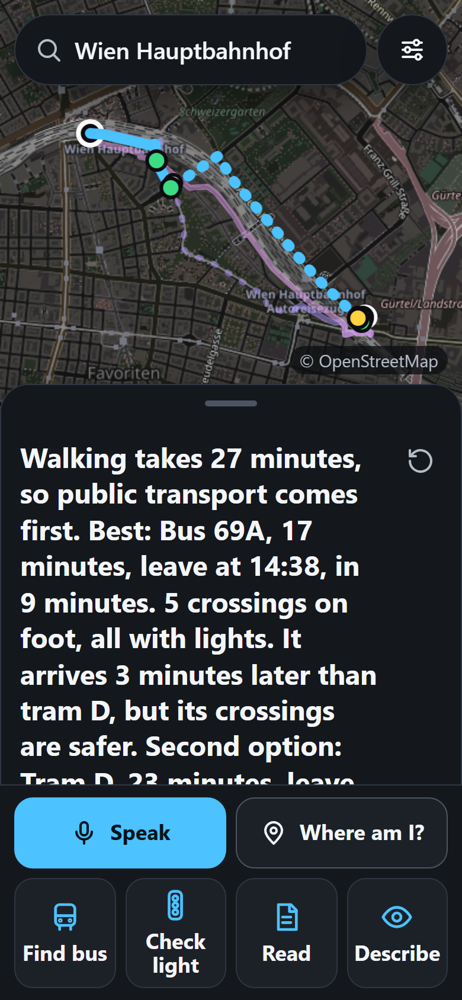
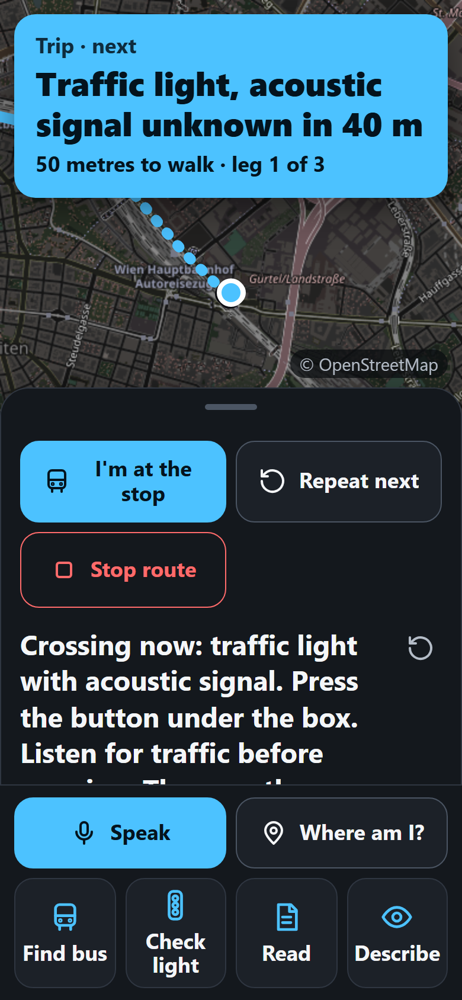
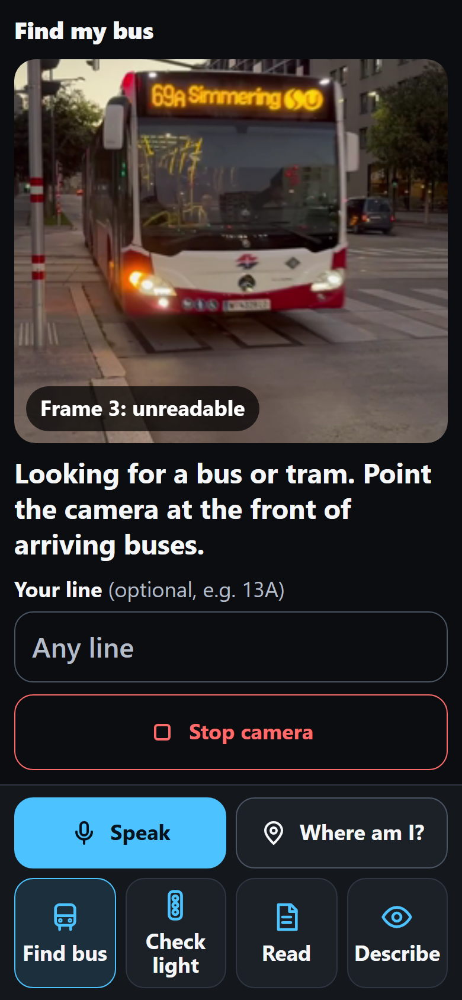

# Crosswise

[](https://github.com/ardapkr/crosswise/actions/workflows/ci.yml)
[](https://crosswise-woad.vercel.app/?demo=1)
[](LICENSE)

**Safer walking routes and a talking camera assistant for blind, low-vision, wheelchair and limited-mobility
pedestrians in Vienna.** Built in ~18 hours at the TELOS Hackathon 2026 in Vienna (Track A1 · Applied AI for Consumers).

> Crosswise assists a white cane or guide dog. It never replaces them.

<p align="center">
  
  
  
  
</p>

**Try it:** open <https://crosswise-woad.vercel.app/?demo=1> on a phone. `?demo=1` simulates walking the chosen
route, so it works indoors.

## The problem

Map apps optimise for the fastest route. For a blind pedestrian, the dangerous part of a walk is not the distance but
the **road crossings**: an unmarked crossing without lights is much riskier than a traffic light with an acoustic
signal. For a wheelchair user, one raised kerb can block a whole route. None of this is visible in "fastest route".
At the bus stop the next problem starts: which bus is this?

## What it does

| Feature | How it works |
|---|---|
| **Safest-crossings route** | Gets up to 3 walking (or wheelchair) routes from OpenRouteService, finds every crossing the route actually uses in OpenStreetMap data, scores them (lights + acoustic signal > lights > zebra > unmarked; kerbs for wheelchairs) and recommends the route whose worst crossing is safest. It says why: *"The recommended route is 1 minute longer and avoids the unmarked crossing on the shortest route."* |
| **Public transport, door to door** | Every search also asks [Transitous](https://transitous.org) (free, open timetable data) for up to 2 bus/tram/U-Bahn trips. If walking takes more than ~20 minutes, public transport is listed first and the app says so. Only the rides come from the timetable: every walking leg (to the stop, changes, to the destination) is routed again by us with the crossing scoring, and ends at the platform of *that line and direction* (the correct side of the street). Spoken per leg: *"Walk 2 minutes to Hüttenbrennergasse. 1 crossing: traffic light with acoustic signal. Take bus 69A towards Hauptbahnhof. 4 stops. Get off at Hauptbahnhof Ost."* |
| **Riding** | Before each ride: line, direction, departure time. On board: stops counted by GPS, or by the timetable when there is no GPS underground (then it says the count is approximate), *"Your stop is next"*, *"Get off now"*. |
| **Crossing alerts while walking** | Live GPS guidance announces each crossing ~40 m before and again at ~10 m: type, acoustic signal, kerb, *"Press the button under the box"*. Turn-by-turn instructions in between, off-route warning. |
| **Find my bus** | Point the phone at arriving buses. It scans ~1 photo per 1.2 s and speaks only when 2 photos agree: *"This is 26A, not your bus"* … *"This is your bus, 13A."* Gives up after 60 s. During a trip the line **and direction** are set automatically and the destination display is read too: *"This is 13A towards Hauptbahnhof, your bus"* or *"13A, but the wrong direction"*. |
| **Check the crossing light** | One photo → *"The pedestrian light looks red. Wait."* It never says "safe to cross" and always adds *"Listen for traffic before crossing."* |
| **Read text / Describe surroundings** | Signs, timetables, door labels; a 3-sentence scene description with hazards first. |
| **Where am I?** | Street and house number, nearest bus/tram stops, nearest crossing and its type. |
| **Voice commands** | Tap **Speak**: *find my bus 13A, take me to Hauptbahnhof, check the light, read this, where am I, wheelchair mode, stop, repeat, help.* |
| **Three modes** | Blind / low vision, Wheelchair (ORS wheelchair profile, kerb-aware), Limited mobility (no steps, fewest crossings, never an unmarked one). |
| **Accessible by design** | Everything is spoken **and** shown as large high-contrast text; buttons ≥ 64 px; real `<button>`s with labels for VoiceOver/TalkBack; speech priority (danger > crossing > navigation > info — nothing important is talked over). |

## Results (details and all failures in [EVAL.md](EVAL.md))

- **30 random real trips around HOIV**: compared with the shortest route, the recommended route has **51% fewer
  unmarked/unknown crossings** (43 → 21), at a median cost of **1.4 minutes** when it differs. Its worst crossing was
  never worse than the shortest route's.
- **Crossing light** on 12 real photos: 10 correct, **0 dangerous errors** in every run (misses: "I cannot see a pedestrian light").
- **5 named Vienna walks** (e.g. HOIV → Hauptbahnhof, HOIV → Wien Mitte): on the 2 where Crosswise picks another route,
  unmarked/unknown crossings go **2 → 0** (+1.0 min) and **8 → 2** (+2.7 min); on the other 3 the shortest route already is the safest.
- **Read text** 3/3, **describe** 10–11/11. **Bus numbers 12/15** in each of 3 runs on 15 real images of a 69A. On far shots
  (50–60 m) the model sometimes misreads a single image (0, 2 and 1 wrong lines in the 3 runs) — the app only speaks a line
  after **2 consecutive frames agree**, and no wrong line was announced in any test.
- 386 unit tests + 58 end-to-end browser tests (fake camera, fake GPS, fake speech, saved real timetable answers).

## How it works

```
Phone browser (plain HTML/CSS/JS, no framework)          Vercel serverless functions (hold the API keys)
  public/js/*   UI, GPS, camera, speech, voice   ──────▶  /api/route     OpenRouteService directions (+ alternatives)
  public/lib/*  pure logic, shared with tests            /api/geocode   OpenRouteService search
    crossings.js  filter, classify, cluster OSM nodes    /api/crossings crossing snapshot (Vienna/Budapest), Overpass elsewhere
    scoring.js    crossing + route scores per mode       /api/look      Claude Haiku 4.5 vision, JSON answers
    guidance.js   when to say what while walking         /api/where     reverse geocode + stops/crossing snapshots
    transit.js / trip.js / ride.js  public transport   /api/transit   Transitous (MOTIS) trips, no key
    scan.js       live bus-scan rules
    look.js       safe wording of camera results
    commands.js   voice command parser
```

- **Crossing data**: all `highway=crossing` / `traffic_signals` nodes of Vienna and Budapest were downloaded **once**
  from Overpass and preprocessed into small snapshots (`public/data/`). Nodes within 20 m are grouped into one
  crossing (an intersection can have 15 nodes); a group keeps the best-known value per attribute, except kerbs,
  where "raised" wins (a wheelchair user must be warned). Kerbs mapped as separate `barrier=kerb` nodes on crossing
  footways are merged in. A crossing counts as "on the route" when the route passes within 3 m of one of its nodes.
- **Vision**: the phone sends a 768 px JPEG; Claude Haiku 4.5 answers with a strict JSON schema per mode
  (`api/prompts.js`); `public/lib/look.js` validates the answer again and builds the sentence from fixed phrases,
  so the model can never make the app say "safe to cross".
- **Demo mode**: `?demo=1` simulates walking the chosen route at 1.3 m/s (`&speed=4` faster, `&at=1450` starts
  1450 m in), so everything can be shown indoors.

All scoring, clustering and camera rules are written down in [docs/design.md](docs/design.md).

## Data sources

- Public transport: [Transitous](https://transitous.org) (community-run MOTIS journey planner on open GTFS data; Wiener Linien, ÖBB)
- Routes and geocoding: [OpenRouteService](https://openrouteservice.org) (foot-walking and wheelchair profiles)
- Crossings, kerbs and stops: © [OpenStreetMap](https://www.openstreetmap.org/copyright) contributors (ODbL), via the Overpass API
- Vision: [Anthropic](https://www.anthropic.com) Claude Haiku 4.5
- Speech: the browser's built-in speech synthesis and speech recognition

## Run it

Needs Node 24 and free API keys for OpenRouteService and Anthropic.

```bash
npm install
npx playwright install chromium   # for the browser tests
npm test                          # unit tests (no keys, no network)
npm run e2e                       # browser tests with fake camera/GPS/speech (no keys)
npm run dev                       # local server on http://localhost:3000 (put keys in .env.local for live APIs)
```

Deploy: `vercel deploy` with `ORS_API_KEY` and `ANTHROPIC_API_KEY` set as Vercel environment variables.
Rebuild the data snapshots (rarely — the public Overpass server is shared): `node scripts/fetch-crossings.js`, then
`node scripts/build-crossings.js`. Measure: `npm run eval:vision` and `node scripts/eval-routes.js`.

## Honest limits

- OpenStreetMap is incomplete: 28% of Vienna's traffic lights have no acoustic-signal information and 71% of crossings
  no kerb information. We say "unknown", we never guess — but we cannot warn about what isn't mapped.
- GPS in the city is often 10–30 m off, so alerts can come early or late.
- The camera assistant is an aid: photos can be misread. Bus numbers are only announced after 2 agreeing photos.
- Voice commands are English only; speech recognition does not work in Firefox.
- Only Vienna and Budapest have offline crossing data; elsewhere a live Overpass query is used.
- Public transport times are the **timetable** (Transitous has no live Wiener Linien delays). Stop counting without GPS
  (underground) is by timetable and therefore approximate — the app says so. Wheelchair access of vehicles comes from
  the timetable's flag; step-free station paths are requested but not verified by us.

## Tests

- **386 unit tests** (Vitest) cover the pure logic in `public/lib/`: crossing filtering and clustering, scoring,
  guidance timing, the bus-scan rules, voice command parsing and the public transport parser. Many use real saved
  OpenStreetMap, OpenRouteService and Transitous answers from `test/fixtures/`.
- **58 browser tests** (Playwright) run the whole app in Chromium with a recorded video as a fake camera, a fake GPS
  position and fake speech, including a real clip of a 69A bus arriving.
- Both suites run on every push in GitHub Actions.

## Team

Built by Arda Peker and teammate Kate at TELOS Hackathon 2026 (HACK_002), HOIV, Vienna.

## License

MIT, see [LICENSE](LICENSE). Map data © OpenStreetMap contributors (ODbL).
